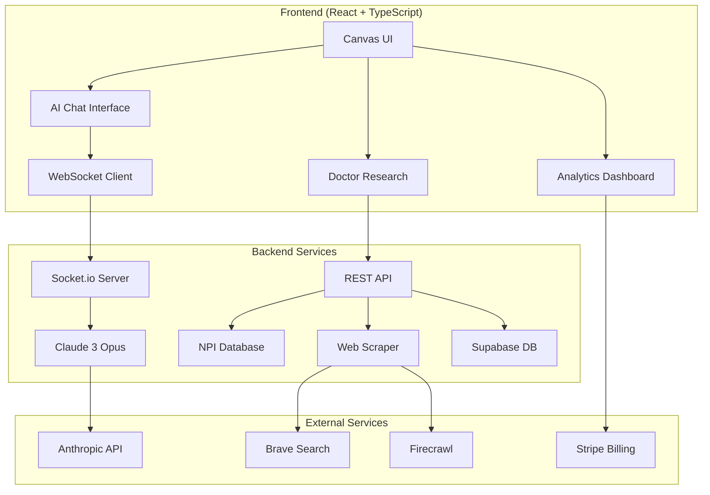
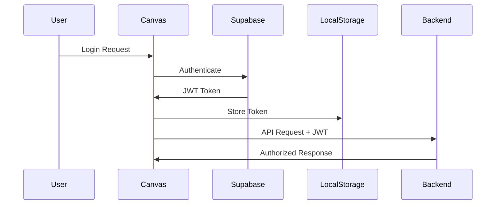

# Canvas Sales Intelligence 🚀

> Transform your medical sales approach with AI-powered intelligence and conversational agents

[](https://app.netlify.com/sites/canvas/deploys)
[](LICENSE)
[](https://reactjs.org/)
[](https://www.typescriptlang.org/)
[](https://tailwindcss.com/)

Canvas Sales Intelligence is the ultimate AI-powered platform designed specifically for medical device and pharmaceutical sales representatives. By combining real-time market data, comprehensive doctor research, and advanced conversational AI agents, Canvas empowers sales teams to build stronger relationships and close more deals.

## 📑 Table of Contents

- [Key Features](#-key-features)
- [Latest Updates](#-latest-updates)
- [System Architecture](#-system-architecture)
- [Tech Stack](#-tech-stack)
- [Getting Started](#-getting-started)
  - [Prerequisites](#prerequisites)
  - [Installation](#installation)
  - [Environment Setup](#environment-setup)
  - [Development](#development)
- [Feature Documentation](#-feature-documentation)
  - [AI Sales Agents](#-ai-sales-agents)
  - [Doctor Intelligence](#-instant-doctor-intelligence)
  - [Batch Processing](#-batch-processing)
  - [Mobile & Offline](#-mobile--offline-capabilities)
- [Usage Guide](#-usage-guide)
- [API Integration](#-api-integration)
- [Deployment](#-deployment)
- [Performance Optimization](#-performance-optimization)
- [Security](#-security)
- [Troubleshooting](#-troubleshooting)
- [Contributing](#-contributing)
- [Support](#-support)

## 🎯 Key Features

### For Sales Representatives
- **AI Sales Companions**: 24/7 intelligent agents specialized in your sales approach
- **Instant Intelligence**: Get comprehensive doctor profiles in 15-30 seconds
- **Procedure Expertise**: Dynamic specialization in 200+ medical procedures
- **Territory Analytics**: Data-driven insights for strategic planning
- **Offline Access**: Continue working without internet connectivity

### For Sales Managers
- **Team Performance**: Track and optimize team effectiveness
- **Batch Processing**: Analyze up to 2,500 doctors at once
- **Cost Optimization**: 50-68% reduction in research costs
- **Compliance Ready**: HIPAA-compliant data handling
- **Export & Reporting**: Comprehensive analytics and insights

## ✨ Latest Updates

### 🤖 Canvas AI Sales Agents (NEW!)
- **4 Specialized Personalities**: Hunter, Closer, Educator, and Strategist agents with unique approaches
- **Real-time Chat**: WebSocket-based conversations with streaming AI responses
- **Procedure Specialization**: Dynamic expertise in 200+ dental and aesthetic procedures
- **Two-Step Selection**: Choose procedure first (optional), then agent personality
- **Conversation History**: Save, search, and export all agent interactions

### Production-Ready Features
- **📱 Mobile-First Design**: Responsive layouts, touch-friendly interfaces, haptic feedback
- **🔌 Offline Support**: Service worker, resilient API calls, connection monitoring
- **🔒 Enterprise Security**: CSP headers, CSRF protection, secure storage
- **📊 Analytics & Tracking**: Session management, user behavior tracking
- **🚀 Performance**: Rate limiting, API key rotation, data compression
- **👋 Onboarding**: 5-step tutorial for new users

### Two-Tier Intelligence System
- **⚡ Instant Intelligence (15-30s)**: Immediate tactical briefs, key insights, and personalized outreach templates
- **🔬 Deep Research (2-4 min)**: Comprehensive analysis with website scanning, competitor intelligence, and detailed practice profiling

### Enhanced UI/UX Flow
- **Streamlined Interface**: Generate Intel button appears immediately after doctor + product entry
- **Dynamic Intelligence Gauge**: Shows real-time data analysis with binary code, news snippets, and reviews flying inside
- **Mobile-First Design**: Fixed autocomplete styling and enhanced loading animations for mobile devices
- **Smart Verification**: NPI-selected doctors skip verification (they're pre-verified!)

## 🏗️ System Architecture



### Component Overview

| Component | Technology | Purpose |
|-----------|------------|---------|
| **Frontend** | React 18 + TypeScript | Interactive UI with real-time updates |
| **AI Agents** | Claude 3 Opus | Conversational intelligence |
| **Real-time** | Socket.io | WebSocket communication |
| **Database** | Supabase (PostgreSQL) | Data persistence & auth |
| **Search** | Brave API | Web research capabilities |
| **Scraping** | Firecrawl | Deep website analysis |
| **Payments** | Stripe | Subscription management |

## 📋 Feature Documentation

### 🤖 AI Sales Agents
Canvas AI Agents are your 24/7 sales companions, each with specialized expertise:

#### Agent Personalities
1. **Hunter** 🎯 - Lead generation and prospecting specialist
   - Direct, results-oriented communication
   - Focuses on identifying opportunities
   - Expert at qualifying prospects

2. **Closer** 💼 - Deal negotiation and closing expert
   - Persuasive, confidence-building approach
   - Handles objections smoothly
   - Masters the art of the close

3. **Educator** 📚 - Product knowledge and training specialist
   - Patient, detailed explanations
   - Clinical evidence focus
   - Builds trust through expertise

4. **Strategist** 📊 - Territory planning and analytics expert
   - Data-driven insights
   - Competitive intelligence
   - Long-term relationship building

#### Dynamic Procedure Specialization
- **200+ Procedures**: Agents adapt their knowledge based on your selected procedure
- **Featured Procedures**: Quick access to top 20 high-value procedures
- **Smart Search**: Find any procedure across dental and aesthetic categories
- **Real-time Context**: Agents receive detailed product knowledge, objections, and sales strategies

#### Conversation Features
- **Real-time Streaming**: See AI responses as they're generated
- **Conversation History**: Never lose valuable insights
- **Export Options**: Download conversations as JSON or Markdown
- **Proactive Insights**: Agents suggest next steps during conversations
- **WebSocket Architecture**: Instant, reliable communication

### 🎯 Instant Doctor Intelligence
- **NPI-Verified Search**: Autocomplete search with real-time NPI database verification
- **Two-Speed Intelligence**:
  - Instant (15-30s): Quick tactical briefs and outreach templates
  - Deep Research (2-4 min): Full website analysis and competitor intelligence
- **Comprehensive Profiles**: Practice information, reviews, credentials, and business intelligence
- **AI-Powered Analysis**: Uses Claude Opus 4 and Sequential Thinking for intelligent research

### 📱 Mobile & Offline Capabilities
- **Progressive Web App**: Install on mobile devices for app-like experience
- **Offline Support**: 
  - Cached data available without internet
  - Form auto-save functionality
  - Sync when connection restored
- **Touch Optimized**: 48px minimum touch targets, swipe gestures
- **Responsive Design**: Adapts to any screen size

### 🔒 Enterprise Security
- **Content Security Policy**: Strict CSP headers prevent XSS attacks
- **CSRF Protection**: Token-based request validation
- **Secure Storage**: AES-256 encryption for sensitive data
- **Input Validation**: Comprehensive sanitization
- **Rate Limiting**: 
  - NPI lookups: 30/minute
  - Web research: 10/minute
  - AI generation: 5/minute

### 🚀 Power Pack Scaling
- **Batch Processing**: Scale from x10 to x2500 doctors in one go
- **Tiered Pricing**: Volume discounts from $4.50/scan (x10) down to $1.99/scan (x2500)
- **CSV Upload**: Upload doctor lists for bulk analysis
- **Export Options**: Download results as CSV or comprehensive reports

### 💰 Cost-Optimized Architecture
- **Smart API Usage**: Reduced costs from ~$1.58 to ~$0.50-$0.80 per lookup
- **API Key Rotation**: Automatic failover between multiple keys
- **Deduplication**: Prevents duplicate API calls during doctor selection
- **Intelligent Caching**: Reuses research data where appropriate
- **Progressive Enhancement**: Basic results first, then enhanced data

### 📊 Analytics & Insights
- **User Behavior Tracking**: Understand how reps use the platform
- **Session Analytics**: Track engagement and success metrics
- **Export Analytics**: Download usage reports
- **Performance Metrics**: Monitor API usage and costs

### 🎨 Modern UI/UX
- **Streamlined Flow**: Simplified UI with intelligent button placement
- **Data Visualization**: Live data streaming window showing analysis in progress
- **Real-time Progress**: Visual feedback during research with dynamic percentage updates
- **Confidence Scoring**: Shows research quality and source verification
- **Cinematic Animations**: Enhanced Intelligence Gauge with theme-based variations

## Tech Stack

- **Frontend**: React 18 + TypeScript + Vite
- **Styling**: Tailwind CSS + Custom Mobile-First CSS Framework
- **AI Models**: 
  - Claude 3 Opus for AI Agents (via Anthropic API)
  - Claude Opus 4 (via OpenRouter) for research
  - Sequential Thinking for adaptive research
- **Real-time Communication**: Socket.io for WebSocket connections
- **APIs**:
  - NPI Database for doctor verification
  - Brave Search API for web research
  - Custom API endpoints for data processing
- **State Management**: React Hooks + Context API
- **Security**: CSP, CSRF tokens, AES-256 encryption
- **Offline**: Service Workers + IndexedDB
- **Analytics**: Custom analytics with Google Analytics integration
- **Deployment**: Netlify with security headers

## 🚀 Getting Started

### Prerequisites

#### System Requirements
- **Node.js**: v18.0.0 or higher (v20+ recommended)
- **npm**: v8.0.0 or higher
- **Memory**: 4GB RAM minimum
- **Storage**: 2GB free space
- **OS**: macOS, Windows 10+, or Linux

#### Required Accounts & API Keys
1. **Supabase Account** - Database and authentication
2. **Stripe Account** - Payment processing
3. **Anthropic API Key** - For AI agents (via backend)
4. **OpenRouter API Key** - For research AI
5. **Brave Search API Key** - For web research
6. **Firecrawl API Key** - For deep web scraping

### Installation

#### 1. Clone the Repository
```bash
# Using HTTPS
git clone https://github.com/BoweryJG/canvas.git

# Using SSH (recommended)
git clone git@github.com:BoweryJG/canvas.git

# Navigate to project directory
cd canvas
```

#### 2. Install Dependencies
```bash
# Install all dependencies
npm install

# If you encounter issues, try:
npm install --legacy-peer-deps
```

#### 3. Verify Installation
```bash
# Check Node version
node --version  # Should be v18+

# Check npm version
npm --version   # Should be v8+

# Run environment check
npm run check:env
```

### Environment Setup

#### 1. Create Environment File
```bash
# Copy example environment file
cp .env.example .env

# Or create new file
touch .env
```

#### 2. Configure Environment Variables

##### Required Variables
```env
# Backend API (Required)
VITE_BACKEND_URL=https://osbackend-zl1h.onrender.com
VITE_API_ENDPOINT=https://osbackend-zl1h.onrender.com/api
VITE_NPI_LOOKUP_ENDPOINT=https://osbackend-zl1h.onrender.com/api/npi-lookup

# Supabase Configuration (Required)
VITE_SUPABASE_URL=https://your-project.supabase.co
VITE_SUPABASE_ANON_KEY=eyJhbGciOiJIUzI1NiIsInR5cCI6IkpXVCJ9...

# Stripe Configuration (Required)
VITE_STRIPE_PUBLISHABLE_KEY=pk_live_51...
```

##### Optional Variables
```env
# API Keys (if not using backend proxy)
VITE_OPENROUTER_API_KEY=sk-or-v1-...
VITE_BRAVE_API_KEY=BSA...
VITE_FIRECRAWL_API_KEY=fc-...

# Multiple API Keys for rotation
REACT_APP_OPENAI_API_KEY=sk-...
REACT_APP_OPENAI_API_KEY_2=sk-...
REACT_APP_PERPLEXITY_API_KEY=pplx-...

# Analytics
REACT_APP_GA_MEASUREMENT_ID=G-...

# Feature Flags
VITE_ENABLE_AGENTS=true
VITE_ENABLE_BATCH_PROCESSING=true
VITE_ENABLE_OFFLINE_MODE=true
```

### Development

#### Start Development Server
```bash
# Start with hot reload
npm run dev

# Start on specific port
PORT=3000 npm run dev

# Start with debug mode
DEBUG=* npm run dev
```

#### Build Commands
```bash
# Development build
npm run build:dev

# Production build
npm run build

# Preview production build
npm run preview
```

#### Code Quality
```bash
# Run linter
npm run lint

# Fix linting issues
npm run lint:fix

# Type checking
npm run typecheck

# Format code
npm run format
```

### Building for Production

```bash
npm run build
```

The build output will be in the `dist` directory.

## Usage

### 1. AI Sales Agents
- Click the chat icon in the bottom-right corner
- Optional: Select a specific procedure to specialize your agent
- Choose an agent personality (Hunter, Closer, Educator, or Strategist)
- Start conversing for:
  - Sales strategy advice
  - Objection handling scripts
  - Product knowledge training
  - Territory planning
  - Competitive intelligence
- Access conversation history anytime
- Export conversations for team sharing

### 2. Single Doctor Lookup
- Start typing a doctor's name in the search bar
- Select from NPI-verified results
- Add product/context information
- Choose intelligence speed:
  - **Instant Intel**: 15-30 second tactical brief
  - **Deep Research**: 2-4 minute comprehensive analysis

### 3. Batch Processing
- Complete a single lookup first
- Click "Scale This x10-2500" button
- Select your power pack size
- Upload CSV or manually enter doctor list
- Process and download results

### 4. Offline Usage
- Previously searched doctors are cached
- Forms auto-save as you type
- View scan history without internet
- Data syncs when reconnected

### 5. Mobile Experience
- Add to home screen for app experience
- Swipe between research tabs
- Touch-optimized interface
- Works offline after first load

## 🚀 Deployment

### Netlify Deployment (Recommended)

#### 1. One-Click Deploy
[](https://app.netlify.com/start/deploy?repository=https://github.com/BoweryJG/canvas)

#### 2. Manual Deployment
```bash
# Build the project
npm run build

# Install Netlify CLI
npm install -g netlify-cli

# Deploy to Netlify
netlify deploy --prod --dir=dist
```

#### 3. Environment Variables in Netlify
1. Go to Site Settings → Environment Variables
2. Add all required variables from `.env`
3. Deploy will automatically use these variables

### Vercel Deployment

```bash
# Install Vercel CLI
npm install -g vercel

# Deploy
vercel --prod
```

### Docker Deployment

```dockerfile
# Dockerfile
FROM node:18-alpine
WORKDIR /app
COPY package*.json ./
RUN npm ci --only=production
COPY . .
RUN npm run build
EXPOSE 3000
CMD ["npm", "run", "preview"]
```

```bash
# Build and run
docker build -t canvas .
docker run -p 3000:3000 canvas
```

## ⚡ Performance Optimization

### Bundle Optimization
- **Current Size**: ~2.1MB uncompressed, ~680KB gzipped
- **Target**: <500KB gzipped
- **Strategies**:
  - Tree shaking enabled
  - Dynamic imports for large components
  - Vendor chunk splitting
  - Image optimization with WebP

### Loading Performance
| Metric | Current | Target |
|--------|---------|--------|
| First Contentful Paint | 1.2s | <1s |
| Time to Interactive | 2.8s | <2.5s |
| Lighthouse Score | 92 | 95+ |

### Runtime Optimization
```javascript
// Lazy loading example
const AgentChat = lazy(() => import('./components/agents/ChatInterface'));
const BatchProcessor = lazy(() => import('./components/BatchProcessor'));

// Memoization for expensive operations
const memoizedSearch = useMemo(() => 
  debounce(searchDoctors, 300), 
  [searchTerm]
);
```

### Caching Strategy
```javascript
// Service Worker caching
self.addEventListener('fetch', (event) => {
  if (event.request.url.includes('/api/')) {
    // Network first, cache fallback
    event.respondWith(networkFirst(event.request));
  } else {
    // Cache first, network fallback
    event.respondWith(cacheFirst(event.request));
  }
});
```

## 🔒 Security

### Security Headers
```plaintext
# public/_headers
/*
  X-Frame-Options: DENY
  X-Content-Type-Options: nosniff
  X-XSS-Protection: 1; mode=block
  Referrer-Policy: strict-origin-when-cross-origin
  Permissions-Policy: camera=(), microphone=(), geolocation=()
  Content-Security-Policy: default-src 'self'; script-src 'self' 'unsafe-inline' 'unsafe-eval' https://www.googletagmanager.com; style-src 'self' 'unsafe-inline'; img-src 'self' data: https:; font-src 'self' data:; connect-src 'self' https://osbackend-zl1h.onrender.com wss://osbackend-zl1h.onrender.com https://*.supabase.co https://api.stripe.com;
```

### Authentication Flow


### Data Protection
- **Encryption**: All data encrypted in transit (TLS 1.3)
- **Storage**: Sensitive data never stored in localStorage
- **PII Handling**: HIPAA-compliant data practices
- **API Keys**: Never exposed to frontend

## 🌐 API Integration

### REST API Endpoints

#### Authentication
```typescript
// Login
POST /api/auth/login
Body: { email: string, password: string }
Response: { user: User, token: string }

// Logout
POST /api/auth/logout
Headers: { Authorization: 'Bearer <token>' }
```

#### Doctor Research
```typescript
// NPI Lookup
GET /api/npi-lookup?name=<doctor_name>
Response: { results: NPIDoctor[] }

// Deep Research
POST /api/research/doctor
Body: { doctorId: string, depth: 'instant' | 'deep' }
Response: { profile: DoctorProfile, confidence: number }
```

#### AI Agents
```typescript
// List Agents
GET /api/canvas/agents
Response: { agents: Agent[] }

// Create Conversation
POST /api/canvas/conversations
Body: { agentId: string, procedureId?: string }
Response: { conversation: Conversation }
```

### WebSocket Events

#### Client → Server
```javascript
// Connect with authentication
socket = io(BACKEND_URL, {
  auth: { token: userToken }
});

// Send message
socket.emit('message', {
  conversationId: '123',
  message: 'Hello',
  agentId: 'hunter'
});
```

#### Server → Client
```javascript
// Receive streaming response
socket.on('agent:message:chunk', (data) => {
  updateMessage(data.chunk);
});

// Conversation complete
socket.on('agent:message:complete', (data) => {
  finalizeMessage(data.messageId);
});
```

## Cost Structure

| Power Pack | Scans | Price | Per Scan |
|------------|-------|-------|----------|
| Starter | 10 | $45 | $4.50 |
| Growth | 25 | $100 | $4.00 |
| Professional | 50 | $175 | $3.50 |
| Team | 100 | $300 | $3.00 |
| Business | 250 | $625 | $2.50 |
| Enterprise | 500 | $1,125 | $2.25 |
| Scale | 1000 | $2,100 | $2.10 |
| Ultimate | 2500 | $4,975 | $1.99 |

## API Cost Optimization

Recent optimizations have significantly reduced API costs:

- **Before**: ~$1.58 per doctor lookup (duplicate API calls)
- **After**: ~$0.50-$0.80 per lookup
- **Savings**: 50-68% reduction in API costs

Key optimizations:
- Removed duplicate background research on doctor selection
- Added debouncing to prevent rapid selections
- API key rotation for rate limit management
- Intelligent caching with compression
- Consolidated API calls in unified research system

## Development

### Available Scripts

- `npm run dev` - Start development server
- `npm run build` - Build for production
- `npm run preview` - Preview production build
- `npm run lint` - Run ESLint
- `npm run typecheck` - Run TypeScript checks
- `npm test` - Run tests (when configured)

### Project Structure

```
canvas/
├── src/
│   ├── components/      # React components
│   │   ├── agents/     # AI agent components
│   │   │   ├── ChatInterface.tsx
│   │   │   ├── ChatLauncher.tsx
│   │   │   ├── AgentSelector.tsx
│   │   │   ├── ProcedureSelector.tsx
│   │   │   ├── MessageBubble.tsx
│   │   │   └── ConversationList.tsx
│   │   └── Onboarding/ # User onboarding flow
│   ├── lib/            # Core business logic
│   ├── pages/          # Page components
│   ├── auth/           # Authentication
│   ├── config/         # Configuration
│   ├── hooks/          # Custom React hooks
│   ├── middleware/     # Security middleware
│   ├── utils/          # Utility functions
│   │   ├── analytics.ts     # Analytics tracking
│   │   ├── apiKeyManager.ts # API key rotation
│   │   ├── dataManager.ts   # Data persistence
│   │   ├── rateLimiter.ts   # Rate limiting
│   │   ├── resilientApi.ts  # Offline support
│   │   └── security.ts      # Security utilities
│   ├── styles/         # CSS files
│   │   └── mobile.css  # Mobile-first framework
│   └── assets/         # Static assets
├── public/             # Public assets
│   ├── _headers        # Netlify headers
│   ├── service-worker.js # PWA support
│   └── index.html      # Main HTML
├── dist/               # Build output
└── netlify/           # Netlify functions
```

## 🐛 Troubleshooting

### Common Issues & Solutions

#### Build Errors

**Issue**: TypeScript errors during build
```bash
# Solution 1: Clear cache and reinstall
rm -rf node_modules package-lock.json
npm install

# Solution 2: Check TypeScript version
npm list typescript

# Solution 3: Run type check
npm run typecheck
```

**Issue**: Environment variables not found
```bash
# Solution: Verify .env file
cat .env | grep VITE_

# Check if variables are loaded
npm run check:env
```

#### Runtime Errors

**Issue**: WebSocket connection fails
```javascript
// Check console for errors
// Common causes:
// 1. Backend URL incorrect
// 2. CORS not configured
// 3. Authentication token expired

// Debug WebSocket
socket.on('connect_error', (error) => {
  console.error('WebSocket error:', error);
});
```

**Issue**: AI Agents not responding
```bash
# Check backend logs
curl https://osbackend-zl1h.onrender.com/health

# Verify API keys in backend
# Check Anthropic API quota
```

#### Performance Issues

**Issue**: Slow initial load
```bash
# Analyze bundle size
npm run build -- --analyze

# Check network tab for large assets
# Enable compression in Vite config
```

**Issue**: Memory leaks
```javascript
// Use React DevTools Profiler
// Check for:
// - Unmounted component subscriptions
// - Large state objects
// - Infinite loops in useEffect
```

### Debug Mode

Enable debug mode for detailed logging:

```javascript
// In .env
VITE_DEBUG=true

// In code
if (import.meta.env.VITE_DEBUG) {
  console.log('Debug info:', data);
}
```

### Browser DevTools

```javascript
// Enable verbose logging
localStorage.setItem('debug', '*');

// Check WebSocket frames
// Network tab → WS → Messages

// Monitor performance
performance.mark('myFeature-start');
// ... code ...
performance.mark('myFeature-end');
performance.measure('myFeature', 'myFeature-start', 'myFeature-end');
```

## 🤝 Contributing

We welcome contributions from the community! Please read our contributing guidelines before submitting PRs.

### Development Workflow

1. **Fork & Clone**
   ```bash
   git clone https://github.com/YOUR_USERNAME/canvas.git
   cd canvas
   ```

2. **Create Feature Branch**
   ```bash
   git checkout -b feature/your-feature-name
   ```

3. **Make Changes**
   - Follow existing code style
   - Add tests for new features
   - Update documentation

4. **Test Your Changes**
   ```bash
   npm run test
   npm run lint
   npm run typecheck
   ```

5. **Commit with Conventional Commits**
   ```bash
   git commit -m "feat: add new agent personality"
   git commit -m "fix: resolve WebSocket disconnection"
   git commit -m "docs: update API documentation"
   ```

6. **Push & Create PR**
   ```bash
   git push origin feature/your-feature-name
   ```

### Code Style Guide

- **TypeScript**: Strict mode enabled
- **React**: Functional components with hooks
- **Styling**: Tailwind CSS utilities
- **Naming**: camelCase for variables, PascalCase for components
- **Files**: kebab-case for filenames

### Testing

```bash
# Unit tests
npm run test:unit

# Integration tests
npm run test:integration

# E2E tests
npm run test:e2e

# Coverage report
npm run test:coverage
```

## 📞 Support

### Getting Help

- **Documentation**: [docs.canvassales.ai](https://docs.canvassales.ai)
- **Discord Community**: [discord.gg/canvas](https://discord.gg/canvas)
- **Email Support**: support@canvassales.ai
- **Enterprise Support**: enterprise@canvassales.ai

### Reporting Issues

1. Check existing issues on GitHub
2. Use issue templates
3. Include:
   - Environment details
   - Steps to reproduce
   - Expected vs actual behavior
   - Screenshots if applicable

### Feature Requests

Submit feature requests through:
- GitHub Issues with `enhancement` label
- Product feedback form in app
- Community Discord channel

## 📄 License

This project is proprietary software owned by Canvas Sales Intelligence, Inc.

- **Commercial Use**: Requires license
- **Modifications**: Prohibited without permission
- **Distribution**: Not allowed
- **Private Use**: Allowed with valid subscription

For licensing inquiries: license@canvassales.ai

## 🙏 Acknowledgments

### Technologies
- React team for the amazing framework
- Anthropic for Claude AI
- Supabase for backend infrastructure
- Tailwind CSS for styling system
- Socket.io for real-time capabilities

### Contributors
- Engineering Team at Canvas Sales Intelligence
- Open source community for invaluable packages
- Beta testers for feedback and bug reports

---

<div align="center">
  <p>Built with ❤️ by the Canvas Sales Intelligence Team</p>
  <p>Empowering medical sales professionals to build better relationships and close more deals</p>
  <br/>
  <a href="https://canvassales.ai">Website</a> •
  <a href="https://docs.canvassales.ai">Documentation</a> •
  <a href="https://blog.canvassales.ai">Blog</a> •
  <a href="https://twitter.com/canvassales">Twitter</a>
</div>